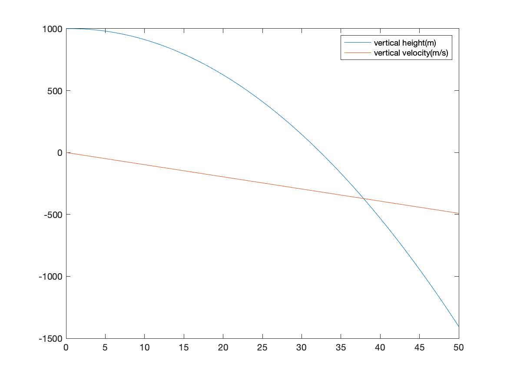
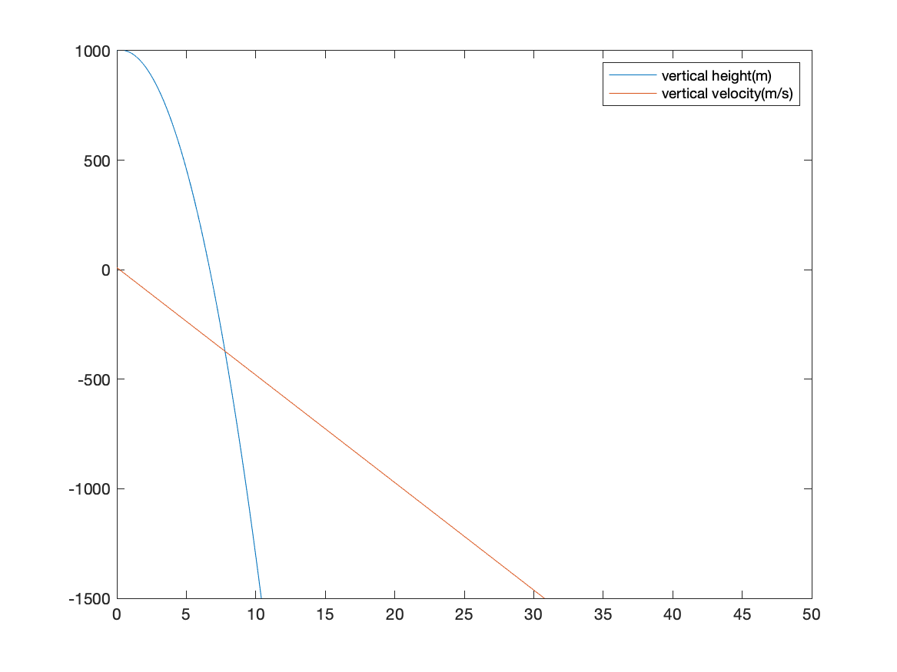
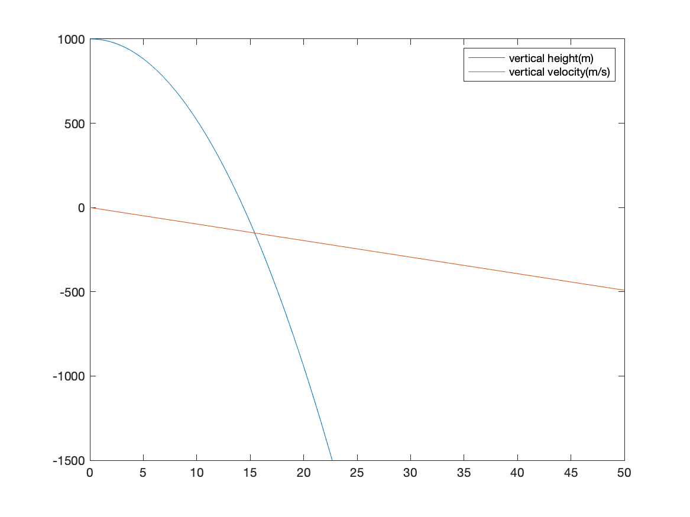
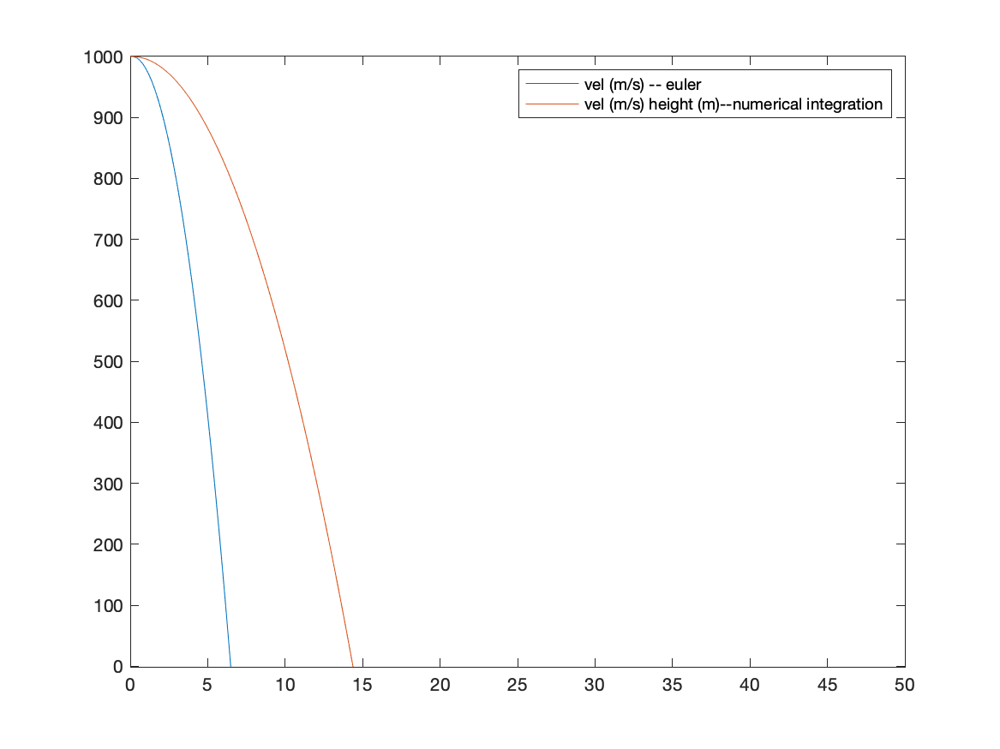
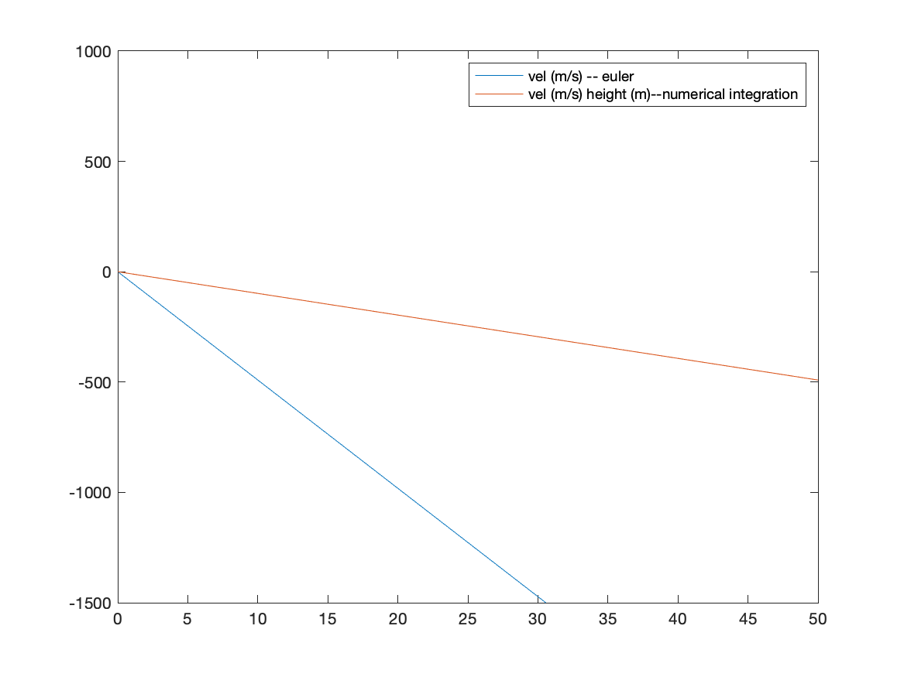

### Week 5 - Switching everything
Ball dynamics and exploration of this zeno phenomena

### Eulers method
<!--  -->


TIME when you hit the ground !


```
    tspan = [t(ii), t(ii+1)];
    % integrate over the time step
    [Tp, Yp] = ode45(@(t,y) mode1(t, x(ii,:)), tspan, ICs, []);
```

#### Numerical integration with ODE45
Running the second example and solving each time step and storing it



#### you can see the difference in estimation

It is worth noting using the equation $$t = (h * a/2)^{1/2}$$
Should theoretically be $t = 14.2857 s$

Height


VEL


#### Some good matlab systems
https://www.12000.org/my_notes/matlab_ODE/

#### Takeaways 
- Numerical integration using over the interval is a much better method than eulers method !

**Integral** method computes the time until the ball hits the ground to be
$$ dt = 0.2 $$
$$72dt < t < 73dt \Rightarrow 14.4 < t < 14.6 $$

**Eulers method** method computes the time until the ball hits the ground to be
$$ 6.6 < t < 6.7 $$

