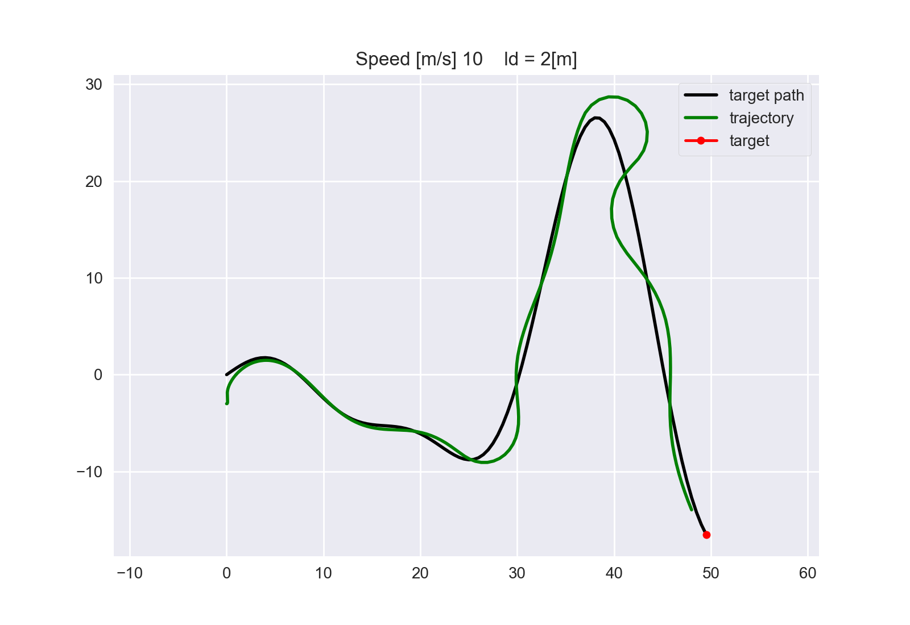

# pure_pursuit_controller
geometric path tracking algorithm

## Control problem 

velocity is controlled by the difference between the look ahead distance and the local target.
```
    av = Kv * crosstrack + Ki * sum(e_hist) * time
```
turning speed is controlled by 
```
    gamma = atan2(targety - currenty , targetx - currentx) - self.yaw
    aw = Kw * alpha
```

### path generation, and state generation
### affect of lookahed distance
```ld = 1```


```ld = 2```


```ld = 4```


```ld = 5```


```ld = 6```


**Note**
robot moves quite slow at the start ? D-Controller ? 
robot cannot keep trajectory if ld < 0.5 or ld > 6

### affect of steering speed gain ```(Kw)```

Using ```ld = 5```

```Kw = 1.1```


```Kw = 2```
Lost tracking...


### affect of velocity P gain ```(Kv)```
```Ki = 0.0001```

```Kv = 0.001```
Lost tracking...


```Kv = 0.0001```
Lost tracking...


```Kv = 0.1```
Lost tracking...


```Kv = 0.5```
Lost tracking...


```Kv = 1```
Lost tracking...


```Kv = 10```
Lost tracking...


### affect of velocity P gain ```(Ki)```
```Kv = 10```

**Take away:**
At high speeds, you get overshoot or instability using control law.
```vmax = 10```, using ```vmax = 5``` works much better with a look ahead distance of 3.

