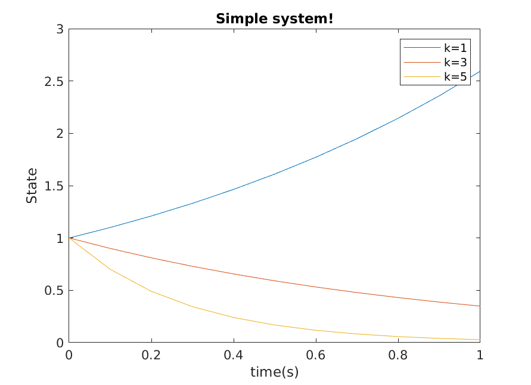
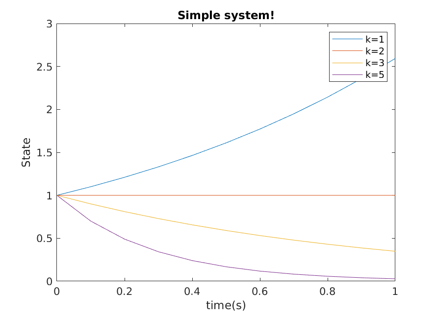

#### simple_systems
$$ \dot{x} = 2x + u $$

Consider closed loop dynamics using state-feedback
$$ \dot{x} = 2x - k_{i}x$$

#### Observations
using state feedback 
When $k_{i} > 2$ the stem will level out ```k = 3, k = 5```
when $k_{i} < 2$ ```k=1``` the system will continue to grow



**What happens at ```K = 2```**
