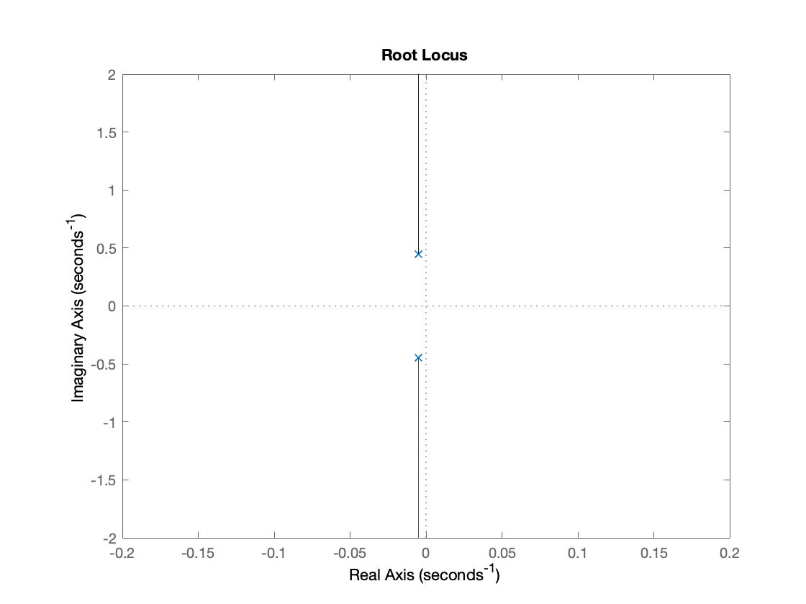
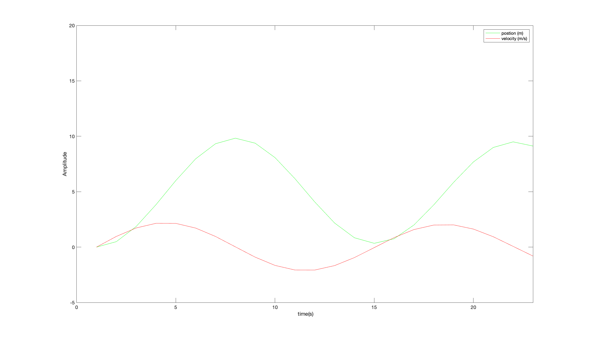
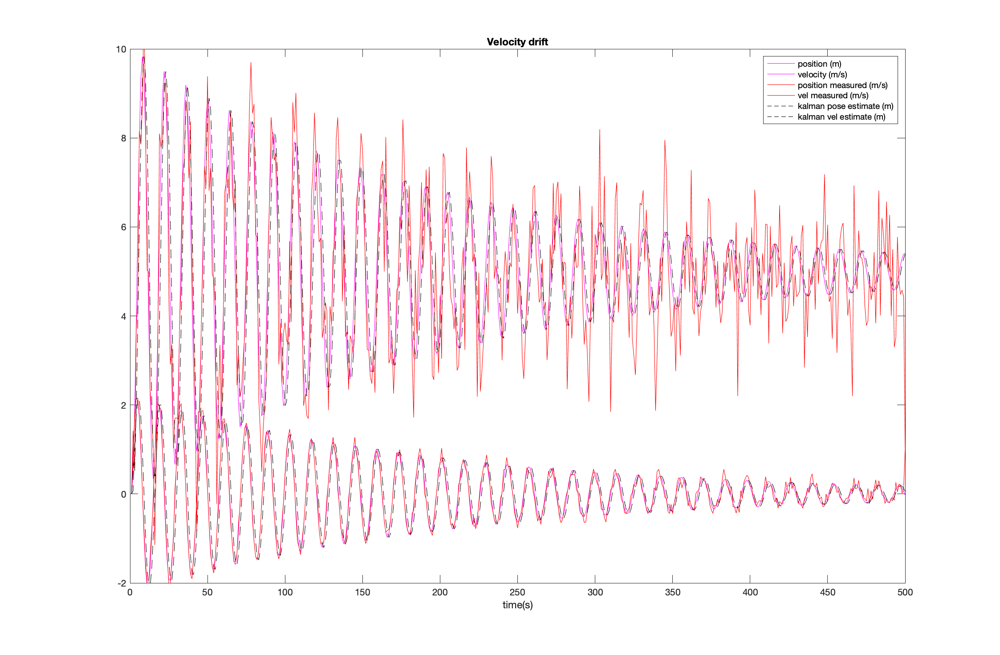

# spring_mass_damper
2nd order spring mass damper system

#### question an alien might ask
Is the open loop system stable. Yes asymptotically stable since the roots are strictly on the left side of the plot.



### Step response ```F = 1``` (little push)
#### What does the system look like


#### measurement model with noise and kalman state recovery.
```black = kalman state recovery```
```red  = measurement (with noise```
```pink  = ground truth measurement```

